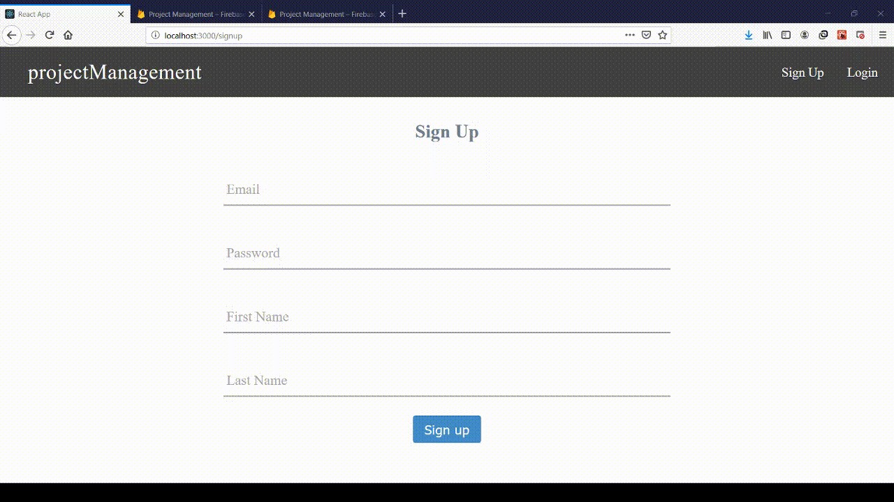

# Link to web app

**https://project-management-9c518.web.app/welcome**

# This is how the application looks like

**Landing Page**

Redux is used to handle the application's state. 

React router is used for single page application routing.(more efficient)

**Sign up**

To ensure that only registered users are able to access the portal, a login/signup feature is
required. The users can login using their respective registered email addresses and
secured passwords.

**Dashboard**

The dashboard will show all the project management actions that have been submitted and the
projects that have been approved will be shown with a green tick on the top. All this will
appear in a card layout.

**Create new project update**

The web-app must enable the users to post their ideas. The ideas will be collected using HTML form
element and on a button click event, the submission process will begin.
The data thus collected will be successfully posted to the back-end database server (Firebase Firestore in our case).

**Handlind invalid routes**

**Admin view (which is visible when someone logs in with admin credentials : userId = admin@admin.com password = admin123**

**Responsive design when viewed on different view ports**

# The major functions of the web-app are:

1) Routing

2) Login/Logout

3) Sign up

4) Post content

5) Put public comments on various posts

6) Approve project (special feature only accessible to the admin)

7) Display different views based on user (Approvers will have different view then that of a normal user)

8) Storing data on to the remote database-server.

9) Cloud functions in action on database trigger.

10) Responsive, so works well on popular mobile device’s viewport.

11) Implement security and protect data integrity using Cloud Firestore security rules.

This project was bootstrapped with [Create React App](https://github.com/facebook/create-react-app).

## Available Scripts

In the project directory, you can run:

### `npm start`

Runs the app in the development mode. 
Open [http://localhost:3000](http://localhost:3000) to view it in the browser.

The page will reload if you make edits. 
You will also see any lint errors in the console.

### `npm test`

Launches the test runner in the interactive watch mode. 
See the section about [running tests](https://facebook.github.io/create-react-app/docs/running-tests) for more information.

### `npm run build`

Builds the app for production to the `build` folder. 
It correctly bundles React in production mode and optimizes the build for the best performance.

The build is minified and the filenames include the hashes. 
Your app is ready to be deployed!

See the section about [deployment](https://facebook.github.io/create-react-app/docs/deployment) for more information.

### `npm run eject`

**Note: this is a one-way operation. Once you `eject`, you can’t go back!**

If you aren’t satisfied with the build tool and configuration choices, you can `eject` at any time. This command will remove the single build dependency from your project.

Instead, it will copy all the configuration files and the transitive dependencies (Webpack, Babel, ESLint, etc) right into your project so you have full control over them. All of the commands except `eject` will still work, but they will point to the copied scripts so you can tweak them. At this point you’re on your own.

You don’t have to ever use `eject`. The curated feature set is suitable for small and middle deployments, and you shouldn’t feel obligated to use this feature. However we understand that this tool wouldn’t be useful if you couldn’t customize it when you are ready for it.

## Learn More

You can learn more in the [Create React App documentation](https://facebook.github.io/create-react-app/docs/getting-started).

To learn React, check out the [React documentation](https://reactjs.org/).

### Code Splitting

This section has moved here: https://facebook.github.io/create-react-app/docs/code-splitting

### Analyzing the Bundle Size

This section has moved here: https://facebook.github.io/create-react-app/docs/analyzing-the-bundle-size

### Making a Progressive Web App

This section has moved here: https://facebook.github.io/create-react-app/docs/making-a-progressive-web-app

### Advanced Configuration

This section has moved here: https://facebook.github.io/create-react-app/docs/advanced-configuration

### Deployment

This section has moved here: https://facebook.github.io/create-react-app/docs/deployment

### `npm run build` fails to minify

This section has moved here: https://facebook.github.io/create-react-app/docs/troubleshooting#npm-run-build-fails-to-minify
